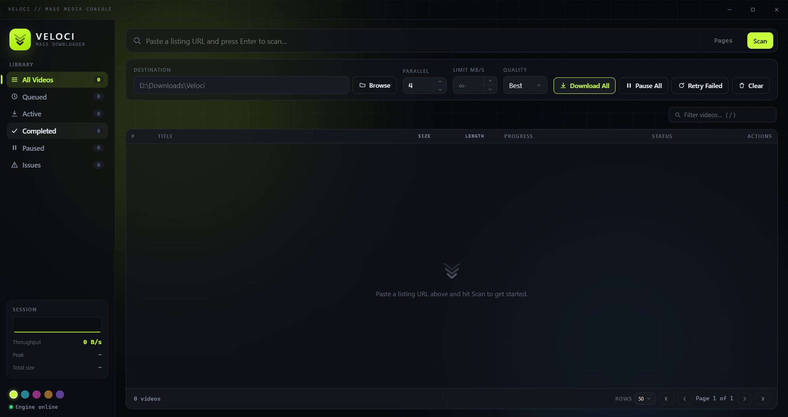

<div align="center">
  

  # Veloci

  **A fast, themed desktop app for scanning and batch-downloading videos from supported listing pages.**

  
  
  
  
  
  
</div>

---

## Overview

Veloci is a Tauri desktop app that scans listing/gallery pages, builds a persistent download queue, and pulls videos down in parallel through a [yt-dlp](https://github.com/yt-dlp/yt-dlp)-powered Python engine. It's built for bulk jobs: point it at a listing page (or a whole page range), let it discover every video on the page, and manage the resulting queue with per-item or bulk controls.

<div align="center">
  
</div>

## Features

- **Multi-page scanning** — scan a single page or a full page range (`1-20`) in one go
- **Concurrent downloads** — configurable parallelism with an optional per-download speed cap
- **Quality selection** — Best/1080p/720p/480p/360p/Worst, with a direct CDN fast-path that skips local re-encoding wherever a site exposes real per-quality files, and automatic ffmpeg-based downscaling as a fallback
- **Pause / resume / cancel** — per video or across the whole queue, IDM-style
- **Duplicate detection** — a SQLite-backed queue remembers what's already been downloaded across sessions, so re-scanning a listing won't re-queue known videos
- **Rich metadata** — thumbnails, titles, duration, and file size are probed and streamed in as they resolve
- **Search, filters, and pagination** — find anything in a queue of hundreds of videos without the UI breaking a sweat
- **Themed UI** — a custom dark "glass" interface with five accent themes, all built from scratch (no OS-native form controls)

## Tech stack

| Layer | Stack |
|---|---|
| Desktop shell | [Tauri 2](https://tauri.app/) (Rust) |
| Frontend | TypeScript + Vite, no framework |
| Download engine | Python, [yt-dlp](https://github.com/yt-dlp/yt-dlp), [httpx](https://www.python-httpx.org/), [selectolax](https://github.com/rushter/selectolax) |
| IPC | Newline-delimited JSON over stdio between the Rust shell and the Python engine |
| Persistence | SQLite (download queue, status, and metadata history) |

## Getting started

### Prerequisites

- [Rust](https://www.rust-lang.org/tools/install) + the [Tauri prerequisites](https://tauri.app/start/prerequisites/) for your platform
- [Node.js](https://nodejs.org/) 18+
- [uv](https://docs.astral.sh/uv/) (Python package/venv manager) with Python 3.11+
- [ffmpeg](https://ffmpeg.org/) on `PATH` (only needed for the local re-encode fallback path)

### Setup

```bash
# Python engine
cd engine
uv sync

# Desktop app (installs JS deps, then runs the Tauri dev build)
cd ../app
npm install
npm run tauri dev
```

A production build (installer + standalone executable) is produced with:

```bash
cd app
npm run tauri build
```

## Project layout

```
Veloci/
├── app/            Tauri shell: Rust backend (src-tauri/) + TypeScript frontend (src/)
└── engine/          Python download engine (yt-dlp subprocess pool, SQLite queue, site extractors)
```

## License

Released under the [MIT License](LICENSE).
